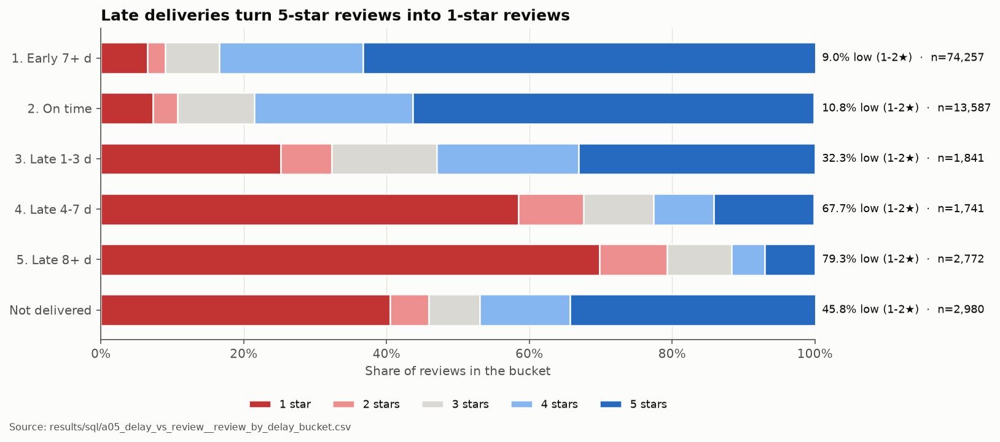
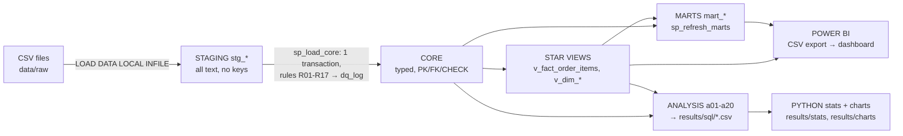

# Olist Marketplace Health: Delivery, Discounts & Seller Supply

End-to-end **SQL (MySQL) + Python stats + Power BI** analysis of a real Brazilian marketplace: how delivery
performance, discounts and seller supply drive reviews, repeat purchases and GMV.


## TL;DR

1. **Late deliveries wreck reviews.** 62.5% of late orders get a 1-2★ review vs 9.2% of on-time orders, **6.8× the risk**
   (+53.2 pp, 95% CI +52.0 to +54.4, p < 0.0001). [T1](results/stats/stats_summary.md) · [a05](results/sql/a05_delay_vs_review__review_by_delay_bucket.csv)
2. **The delivery promise breaks on a few long lanes.** The 10 worst seller→customer lanes hold **70% of late orders**.
   North customers wait a median **20 days vs 9** in the Southeast and pay **18.5% of GMV in freight vs 13.2%**.
   [a04](results/sql/a04_delivery_sla_by_lane__lane_sla_state.csv) · [T6](results/stats/stats_summary.md) · [a20](results/sql/a20_freight_economics__freight_rollup_region.csv)
3. **Growth is acquisition-only and supply is concentrated.** Only **1.99%** of customers re-order within 180 days, and
   **18.4% of sellers make 80% of GMV**. [a01](results/sql/a01_executive_kpis__kpi_summary.csv) · [a17](results/sql/a17_pareto_concentration__pareto_sellers_summary.csv)

**Recommendation:** fix the 10 worst lanes and run a seller-quality programme for sellers later than their category average.
Together that's ≈ **1,690 fewer low reviews a year**. **A/B test** a second-order voucher (21,174 customers per arm) instead of
rolling it out, because the observed voucher effect is not significant. → [docs/recommendations.md](docs/recommendations.md)

## Dashboard



*Power BI dashboard (2 pages: Marketplace Ops Overview · Customers & Seller Supply).* The model, M scripts, 29 DAX
measures, theme and a click-by-click build guide are in [`powerbi/`](powerbi/BUILD_GUIDE.md). Live link, screenshots
(`powerbi/screenshots/`) and PDF (`powerbi/olist_dashboard.pdf`) are added after the Windows build:
**live dashboard: coming soon** · **PDF: coming soon**.

## Business problem

| | |
|---|---|
| Stakeholder | Head of Marketplace Operations & Growth, Olist |
| Primary question | Which delivery failures, discount practices and seller-supply gaps are costing Olist 5-star reviews, repeat customers and GMV, and what should be fixed first? |
| Sub-questions | Q1 marketplace health (GMV, orders, AOV, growth) · Q2 where the delivery promise breaks (lanes, sellers, categories) · Q3 does a late first order reduce reviews and repeat purchase? · Q4 do voucher-paid first orders bring customers back? · Q5 which seller-acquisition channels produce sellers that sell? · Q6 how concentrated is GMV? |

## Data

Two public datasets by Olist (Kaggle), **CC BY-NC-SA 4.0**: the
[Brazilian E-Commerce Public Dataset](https://www.kaggle.com/datasets/olistbr/brazilian-ecommerce) and the
[Marketing Funnel](https://www.kaggle.com/datasets/olistbr/marketing-funnel-olist). Data © Olist; not redistributed here.
Analysis window: **2017-01-01 → 2018-08-31** (set in `cfg_params`).

| File | Rows loaded |
|---|---:|
| olist_orders_dataset.csv | 99,441 |
| olist_order_items_dataset.csv | 112,650 |
| olist_order_payments_dataset.csv | 103,886 |
| olist_order_reviews_dataset.csv | 99,224 |
| olist_customers_dataset.csv | 99,441 |
| olist_sellers_dataset.csv | 3,095 |
| olist_products_dataset.csv | 32,951 |
| olist_geolocation_dataset.csv | 1,000,163 |
| product_category_name_translation.csv | 71 |
| olist_marketing_qualified_leads_dataset.csv | 8,000 |
| olist_closed_deals_dataset.csv | 842 |
| **Total** | **1,559,764** |

Every count matches the expected size exactly ([load check](results/sql/02_load_staging__row_counts.txt)).

## Architecture



ER diagrams (core + star): [docs/erd.md](docs/erd.md) · data dictionary: [docs/data_dictionary.md](docs/data_dictionary.md) ·
metric definitions: [docs/metric_definitions.md](docs/metric_definitions.md)

## Data cleaning (highlights)

| Issue | Fix | Rows |
|---|---|---:|
| Windows `\r\n` line endings in 2 files (not flagged by `file`) left an invisible `\r` on category names | `LINES TERMINATED BY '\r\n'` + audit check for control characters | 2 files |
| Raw backslashes (a review ending in `\"`) would shift columns under MySQL's default escaping | `ESCAPED BY ''` | a handful of rows |
| Duplicate reviews per order | keep latest per order (`ROW_NUMBER() = 1`) | 551 removed |
| Timestamps out of order (e.g. carrier before approval) | flag `ts_anomaly`, keep in GMV, exclude from SLA | 1,382 orders |
| Missing / untranslated categories | `sem_categoria` / `unknown`; keep Portuguese name | 610 / 13 products |
| Geolocation: ~1M points, some outside Brazil | bounding box + centroid per zip prefix | 42 dropped → 19,010 zips |

The load runs in **one transaction** (rollback proved with a planted CHECK violation). The audit shows
**33 PASS · 1 WARN · 0 FAIL**. Full log: [docs/data_quality_log.md](docs/data_quality_log.md).

## Analysis modules

| File | Question | Key result |
|---|---|---|
| [a01](sql/analysis/a01_executive_kpis.sql) | How big and healthy is the marketplace? | R$ 15.68M GMV, 97,905 orders, AOV R$ 160.19, 93.1% on time, 13.8% low reviews |
| [a02](sql/analysis/a02_monthly_trends.sql) | How is GMV growing MoM / YoY? | 8.6× from Jan-2017 to the Nov-2017 peak; YoY slowed from +705% to +51% |
| [a03](sql/analysis/a03_daily_spine_by_region.sql) | True daily orders per region, counting zero days? | North: 70 zero days; naive average overstated by 13% |
| [a04](sql/analysis/a04_delivery_sla_by_lane.sql) | Which lanes break the promise most? | SP→SP most late orders (1,424); SP→AL worst rate (23.6%) |
| [a05](sql/analysis/a05_delay_vs_review.sql) | How does lateness change reviews? | Low reviews 10.8% on time → 79.3% when 8+ days late |
| [a06](sql/analysis/a06_worst_sellers_per_category.sql) | Which sellers drag their category down? | 257 seller-category pairs above average cause 47.8% of late deliveries |
| [a07](sql/analysis/a07_fanout_trap.sql) | Why do naive joins overstate revenue? | Items ⋈ payments overstates GMV +4.56%, payments +28.06% |
| [a08](sql/analysis/a08_items_vs_payments_reconciliation.sql) | Do item totals match payments? | 98.92% match to the cent; 772 payments-only orders |
| [a09](sql/analysis/a09_anti_and_semi_joins.sql) | Unreviewed orders, silent sellers, 5★ customers | 636 unreviewed deliveries; 1,232 sellers silent 90+ days |
| [a10](sql/analysis/a10_set_operations.sql) | Lapsed buyers, sellers active in both H1s | 42,370 of 43,034 2017 buyers didn't return in 2018 |
| [a11](sql/analysis/a11_cohort_retention.sql) | Do customers come back month after month? | Month-1 retention 0.22-0.71% |
| [a12](sql/analysis/a12_repeat_and_time_to_second.sql) | How fast and who repeats? | Median 105 days to return; 1.58% (late) vs 2.02% (on time) |
| [a13](sql/analysis/a13_rfm_segmentation.sql) | Most valuable customers? | "At risk - high value" = 22% of people, 40% of GMV |
| [a14](sql/analysis/a14_seller_gaps_islands.sql) | How stable is seller supply? | 58.5% of sellers had a 2+ month silent spell |
| [a15](sql/analysis/a15_order_status_funnel.sql) | Where do orders get stuck? | 97.07% delivered; transit = 9.35 of 12.58 days |
| [a16](sql/analysis/a16_seller_acquisition_funnel.sql) | Which lead channels produce real sellers? | 8,000 MQLs → 842 won → 379 sold → 182 steady |
| [a17](sql/analysis/a17_pareto_concentration.sql) | How concentrated is GMV? | Top 1% of sellers = 25.7% of GMV; 18.4% of sellers = 80% |
| [a18](sql/analysis/a18_categories_and_strings.sql) | Leading categories and cities? | health_beauty #1 (R$ 1.43M); São Paulo = 37% of SP orders |
| [a19](sql/analysis/a19_basket_self_join.sql) | Which categories are bought together? | Only 0.80% of orders span 2+ categories; one pair with lift > 1 |
| [a20](sql/analysis/a20_freight_economics.sql) | Is freight hurting remote customers? | Freight 11.8% of price under 100 km vs 22.6% beyond 1,500 km |

Plain-English explanation of every query: [docs/walkthrough.md](docs/walkthrough.md).

## Statistics

| Test | Question | n | Effect | 95% CI | p | Conclusion |
|---|---|---|---|---|---|---|
| T1 | Late → low review? | 6,354 / 87,844 | +53.24 pp (62.48% vs 9.24%) | +52.03 to +54.44 pp | < 0.0001 | Yes, RR 6.76 |
| T2 | Review mix by delay bucket | 94,198 | Cramér's V 0.228 | - | < 0.0001 | Strong dependence |
| T3 | Late first order → less repeat? | 3,918 / 52,108 | −0.44 pp (1.58% vs 2.02%) | −0.81 to +0.02 pp | 0.057 | Not significant |
| T4 | Voucher first order → more repeat? | 2,316 / 54,967 | +0.54 pp (2.50% vs 1.97%) | −0.04 to +1.26 pp | 0.071 | Not significant, self-selected |
| T5 | T3 adjusted (logit, HC1) | 56,026 | OR 0.79 for late first order | 0.61 to 1.02 | 0.071 | Same direction, not significant |
| T6 | Slower in North / Northeast? | 1,771 / 8,890 vs 65,108 | median +11 / +8 days vs Southeast | +11 to +12 / +8 to +9 | bootstrap | Yes |
| T7 | Voucher A/B test size | - | MDE +0.40 pp (1.99% → 2.39%) | - | α 0.05, power 0.8 | 21,174 per arm |

Details, caveats (selection bias, mediator exclusion, low base rate): [results/stats/stats_summary.md](results/stats/stats_summary.md) ·
notebook: [notebooks/01_statistical_tests.ipynb](notebooks/01_statistical_tests.ipynb)

## Key findings

* **Reviews are a delivery problem.** Low-review share is 9.0% when parcels arrive 7+ days early and 79.3% when 8+ days late
  (avg score 4.31 → 1.70). [chart](results/charts/02_review_by_delay.png)
* **Lanes, not the whole network.** 70 lanes qualify; the top 10 by late orders hold 4,286 of 6,107 late orders.
  Northeast-bound parcels are late 12-13% of the time vs 6.4% within the Southeast. [chart](results/charts/07_lane_late_heatmap.png)
* **Distance taxes remote customers twice.** Beyond 1,500 km, freight is 22.6% of item price, delivery takes 20.5 days and
  11.6% arrive late, vs 11.8%, 6.5 days and 4.5% under 100 km. [a20](results/sql/a20_freight_economics__freight_by_distance_band.csv)
* **Customers rarely return.** 1.99% repeat within 180 days and month-1 cohort retention is 0.22-0.71%. Returners take a median
  105 days. [chart](results/charts/03_cohort_heatmap.png) · [a12](results/sql/a12_repeat_and_time_to_second__time_to_second_order_dist.csv)
* **Experience and vouchers don't measurably move repeat purchase.** The gaps point the expected way, but all CIs include
  zero (T3-T5). [chart](results/charts/04_repeat_late_vs_ontime_ci.png)
* **Seller supply is fragile and concentrated.** 18.4% of sellers make 80% of GMV, 58.5% of sellers had a 2+ month silent
  spell, and only 45% of signed sellers ever sell. [chart](results/charts/06_pareto_sellers.png) · [chart](results/charts/05_lead_funnel.png)
* **GMV plateaued in 2018** after 8.6× growth to the Nov-2017 peak. [chart](results/charts/01_monthly_gmv.png)

## Recommendations

| # | Action | Estimated impact / year |
|---|---|---|
| 1 | Fix the 10 lanes with the most late orders | ≈ 1,369 fewer low reviews |
| 2 | Seller quality programme for sellers above their category's late rate | ≈ 321 fewer low reviews |
| 3 | Lane-specific delivery promise (A/B tested, conversion guardrail) | up to ≈ 734 fewer low reviews |
| 4 | Shift seller acquisition from social to search channels | ≈ R$ 56,850 first-90-day GMV per 1,000 leads moved |
| 5 | A/B test a second-order voucher (21,174 per arm) before any rollout | ≈ 308 repeat customers / R$ 49,417 GMV *if* +20% lift |

Formulas, assumptions, owners and validation plans: [docs/recommendations.md](docs/recommendations.md)

## SQL skills shown

Recursive CTEs, window functions (ROW_NUMBER/RANK/DENSE_RANK/NTILE/PERCENT_RANK/CUME_DIST, LAG/LEAD, FIRST/LAST_VALUE,
frames), gaps-and-islands, cohorts, funnels, FULL OUTER JOIN emulation, anti/semi joins, set operations, ROLLUP,
stored functions/procedures, transactions, indexes and EXPLAIN ANALYZE, spatial distance.
→ [docs/sql_concept_coverage.md](docs/sql_concept_coverage.md) · MySQL substitutes for Postgres features →
[docs/mysql_workarounds.md](docs/mysql_workarounds.md) · index benchmarks → [docs/performance.md](docs/performance.md)

## How to reproduce

Requirements: macOS or Linux, MySQL ≥ 8.0.31 (8.4 LTS used), Python 3.11+, a Kaggle API token. Power BI Desktop (Windows) only for the dashboard.

```bash
git clone <this repo> && cd olist-marketplace-analytics
cp .env.example .env          # set MYSQL_PASSWORD (and MYSQL_PORT if not 3306)
make venv                     # Python virtualenv + requirements
make download                 # Kaggle CLI -> data/raw (11 CSVs)
make db-user                  # one-time, as MySQL root: app user + local_infile etc.
make all                      # db load core quality perf model analysis stats export (about 4 minutes)
```

`make all` rebuilds everything from an empty database: staging load, transform, quality gate (fails on any FAIL),
index benchmark, star schema + marts, 43 result CSVs, the stats notebook and charts, and the Power BI CSV export.
Then follow [powerbi/BUILD_GUIDE.md](powerbi/BUILD_GUIDE.md). Run a single file with `make sql FILE=sql/analysis/a04_delivery_sla_by_lane.sql`.

## Limitations & next steps

* **No cost/margin or CAC data.** Impact is sized in reviews and GMV, not profit; channel ROI can't be computed.
* **Observational.** Only T1/T2 effects are large enough to act on directly; the repeat-purchase effects need the proposed
  experiments.
* **Rare outcome.** At a 2% repeat rate, customer-level effects are under-powered (T3/T4 CIs include zero).
* **Delivery dates are day-level**, and 1.39% of orders with inconsistent timestamps are excluded from SLA statistics.
* **Next:** add carrier ids and RTO/cancellation reasons, NLP on Portuguese review text, clickstream for conversion, then
  run the promise-padding and voucher tests.

## Repository structure

```
olist-marketplace-analytics/
├── README.md · PROJECT_SPEC.md · LICENSE · Makefile · requirements.txt · .env.example · .gitignore
├── data/raw/                  (git-ignored; Kaggle CSVs)
├── sql/
│   ├── setup/                 00-10: database, staging, load, core, functions, procedures, transform,
│   │                          quality audit, indexes, star schema views, marts
│   └── analysis/              a01-a20 analysis modules
├── python/                    db.py · load_fallback.py · run_analysis.py · export_powerbi.py · make_charts.py · fill_readme.py
├── notebooks/                 01_statistical_tests.ipynb (T1-T7)
├── results/
│   ├── sql/                   one CSV per @query (+ load counts, dq_log, audit, rollback test)
│   ├── stats/                 stats_summary.md, tests.csv, impact_sizing.csv, detail tables
│   ├── charts/                7 PNG charts
│   └── perf/                  EXPLAIN ANALYZE output
├── powerbi/                   BUILD_GUIDE.md · DAX_measures.md · power_query_M.md · theme.json · data/ (git-ignored)
└── docs/                      data dictionary, quality log, metrics, ERD, workarounds, performance,
                               concept coverage, walkthrough, recommendations, interview prep
```

## Author

**Nandhagopan Nair**, B.Tech, IIT (BHU) Varanasi (2027)
LinkedIn: *add link* · GitHub: *add link*

Code: MIT ([LICENSE](LICENSE)). Data: © Olist, CC BY-NC-SA 4.0 (not included in this repository).
