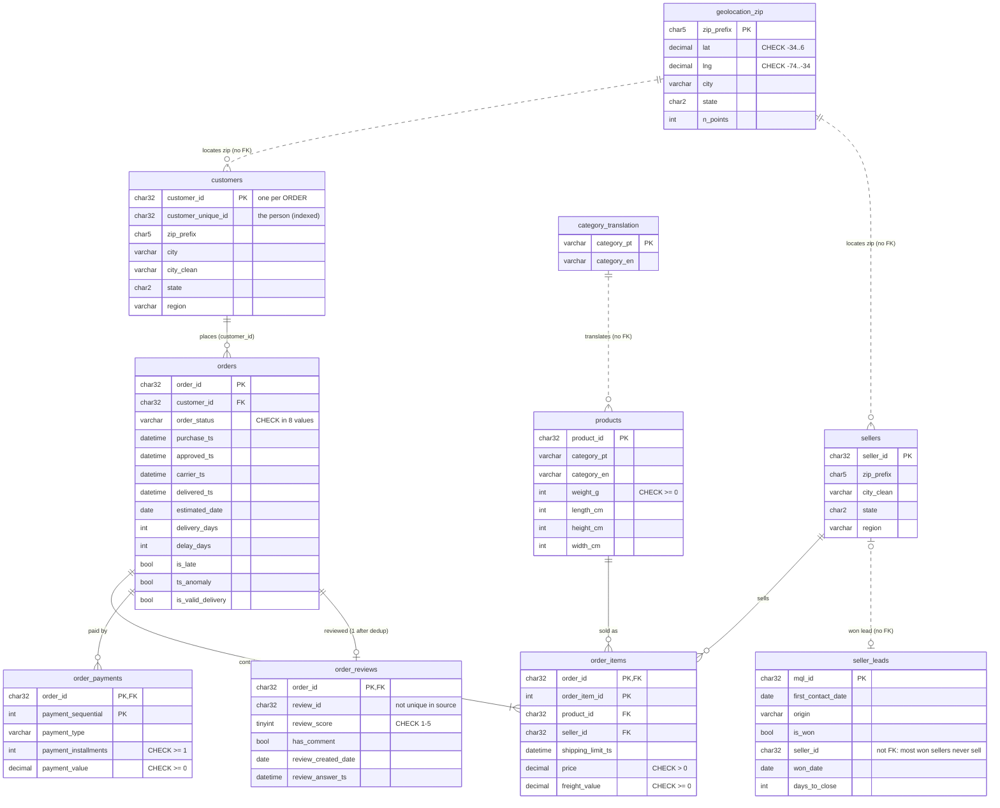
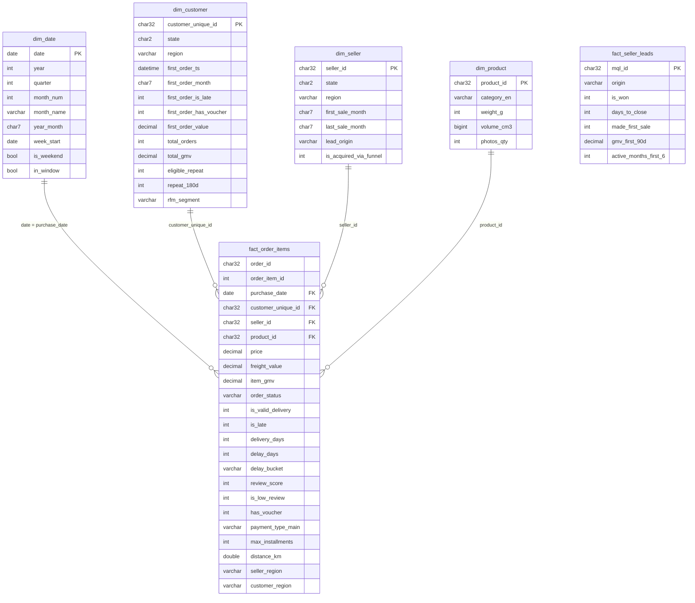

# Entity-relationship diagrams

GitHub renders the Mermaid blocks below. PK = primary key, FK = enforced foreign key.

## 1. Core (normalised, constrained) schema - `sql/setup/03_core_schema.sql`

## 2. Star schema (analysis + Power BI) - `sql/setup/09_star_schema_views.sql`

One fact at **order-item grain**; order-level attributes (delivery, review, payment) are denormalised onto each item.
All relationships are many-to-one, single direction. `fact_seller_leads` and the marts stand alone.

Helper view `v_valid_orders` (order grain) feeds the fact and `v_dim_customer`; it is the single place where
"valid order" is defined. Marts (`mart_monthly_kpis`, `mart_lane_sla`, `mart_cohort_retention`,
`mart_seller_monthly`, `mart_pareto_sellers`) are pre-aggregated tables refreshed by `sp_refresh_marts()`.
