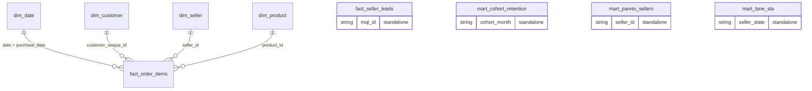

# Power BI build guide (click by click)

Builds `olist_dashboard.pbix`: **2 pages, 16:9 (1280 × 720)**, from the CSVs exported by `make export`.
Estimated time: **3-4 hours** the first time. Want Claude Code to do the clicking? See
[CLAUDE_CODE_WINDOWS.md](CLAUDE_CODE_WINDOWS.md) (MCP for the model, PBIP files for the pages).

Files you need from this repo:

| File | Use |
|---|---|
| `powerbi/data/*.csv` (9 files + `_manifest.csv`, `_schema.csv`) | the data, created by `make export` |
| `powerbi/power_query_M.md` | one M script per table (paste into Advanced Editor) |
| `powerbi/DAX_measures.md` | all measures, formats and the expected values to validate against |
| `powerbi/theme.json` | report theme "Olist Ops" |

---

## 0. Prerequisites and platform

* **Power BI Desktop runs on Windows only.** Options:
  * any Windows PC (college lab, a friend's laptop) - copy the CSVs over;
  * a Windows VM on a Mac (Parallels / VMware Fusion with Windows 11 ARM). Install Power BI Desktop from the
    Microsoft Store **early** and open it once to test - VM installs sometimes need an update first.
* Power BI Desktop (current monthly release). No Pro licence is needed to build and save a `.pbix`.
* Before you start: File → Options and settings → Options → **Current file → Data Load**: untick
  **Auto date/time** and untick **Autodetect new relationships after data is loaded**. We create the
  relationships ourselves; auto-detected ones would be wrong (e.g. `region` ↔ `region`).

## 1. Copy the data to the Windows machine

1. On the Mac/Linux machine: `make export` (prints row counts; the manifest must show 9 files).
2. Copy the whole `powerbi/data/` folder to e.g. `C:\olist\powerbi\data\`.
3. Check `_manifest.csv` - expected rows:

| file | rows |
|---|---:|
| dim_date.csv | 852 |
| dim_customer.csv | 94,703 |
| dim_seller.csv | 3,095 |
| dim_product.csv | 32,951 |
| fact_order_items.csv | 111,752 |
| fact_seller_leads.csv | 8,000 |
| mart_cohort_retention.csv | 210 |
| mart_pareto_sellers.csv | 3,029 |
| mart_lane_sla.csv | 410 |

## 2. Load the tables with Power Query

1. Home → **Transform data** (opens Power Query Editor).
2. Home → Manage Parameters → **New Parameter**: Name `DataFolder`, Type `Text`,
   Current value `C:\olist\powerbi\data\` (**keep the trailing backslash**) → OK.
3. For each of the 9 tables in `power_query_M.md`:
   Home → New Source → **Blank Query** → Home → **Advanced Editor** → select all, paste the M block → Done →
   in Query Settings rename the query to the table name (e.g. `fact_order_items`).
4. Check each preview: no column shows `Error`; the type icons are 123 (whole number), $ (fixed decimal),
   1.2 (decimal), calendar (date) or ABC (text).
5. Right-click `DataFolder` → untick *Enable load* (it is only a parameter).
6. Home → **Close & Apply**.

## 3. Model view

### 3.1 Relationships (Model view → Manage relationships → New)

All four: **Many-to-one (*:1), Single cross-filter direction, Active**.

| From (many side) | To (one side) |
|---|---|
| `fact_order_items[purchase_date]` | `dim_date[date]` |
| `fact_order_items[customer_unique_id]` | `dim_customer[customer_unique_id]` |
| `fact_order_items[seller_id]` | `dim_seller[seller_id]` |
| `fact_order_items[product_id]` | `dim_product[product_id]` |

`fact_seller_leads`, `mart_cohort_retention`, `mart_pareto_sellers`, `mart_lane_sla` get **no relationships**.
They have different grains (lead, cohort-month, seller rank, lane), and joining them to the
dimensions would create ambiguous filter paths: two ways to reach the same table, where Power BI disables
one or filters unpredictably. Each is used in standalone visuals with its own slicers.


*(Screenshot placeholder: `powerbi/screenshots/model_view.png`.)*

**Why single-direction:** filters flow dimension → fact only. A bidirectional relationship would let the fact
filter `dim_customer`, which then filters other facts. That causes slow, surprising totals and ambiguity.
Order-level attributes are already denormalised onto the fact, so no bidirectional filtering is ever needed.

### 3.2 Date table and sorting

1. Select `dim_date` → Table tools → **Mark as date table** → Date column `date` → OK.
2. Select `dim_date[month_name]` → Column tools → **Sort by column** → `month_num`.
3. `fact_order_items[delay_bucket]` values start with "1." … "5." so they already sort in delay order
   ("Not delivered" sorts last).

### 3.3 Hide keys, set formats

* Hide in report view (right-click → Hide): every `*_id` column (`order_id`, `order_item_id`, `customer_unique_id`,
  `seller_id`, `product_id`, `first_order_id`, `mql_id`, `landing_page_id`) **except** `dim_seller[seller_id]`
  (needed for the Top-N table), plus `purchase_date` on the fact (use `dim_date[date]` instead).
* Column formats (Column tools → Format): money columns `R$ #,##0.00` (choose Currency → custom "R$");
  `mart_*[*_pct]` and `mart_pareto_sellers[cum_gmv_share]` → Percentage, 1 decimal (marts store fractions 0-1).
* Set `Summarization` to **Don't summarize** for: `review_score`, `delivery_days`, `delay_days`, `is_*` flags,
  `months_since`, `gmv_rank`, `seller_pct_rank`.

### 3.4 Helper columns (seller short code, readable axis labels)

`dim_seller` → New column:
```DAX
seller_code = LEFT ( dim_seller[seller_id], 8 )
```

`dim_customer` → two new columns, used as the X-axes of the two repeat-rate charts on page 2 (section 7), so the
axes read as words instead of 0 / 1:
```DAX
first_order_delivery = SWITCH ( dim_customer[first_order_is_late], 1, "Late first order", 0, "On-time first order" )
first_order_payment = IF ( dim_customer[first_order_has_voucher] = 1, "Voucher on first order", "No voucher" )
```
`first_order_delivery` is blank for customers whose first order has no valid delivery (`first_order_is_late` blank).

## 4. Measures

1. Home → **Enter data** → name `_Measures` → Load.
2. Paste every measure from `DAX_measures.md` (New measure, one at a time), set its format as listed there,
   then delete `Column1` from `_Measures`.
3. **What-if parameter**: Modeling → New parameter → **Numeric range** → Name `Top N`, Whole number,
   Minimum 5, Maximum 25, Increment 1, Default 10, ✔ *Add slicer to this page* → Create.
4. Tooltip helper for the Top-N table (optional, not part of the core measure set):
```DAX
Main Category =
VAR cat_gmv = ADDCOLUMNS ( VALUES ( dim_product[category_en] ), "@gmv", [GMV] )
RETURN MAXX ( TOPN ( 1, cat_gmv, [@gmv], DESC ), dim_product[category_en] )
```
5. **Validate** with a temporary table visual (no filters) against the "Expected values" table at the end of
   `DAX_measures.md`: GMV R$ 15,683,707 · Orders 97,905 · AOV R$ 160.19 · On-time % 93.1% ·
   Avg Delivery Days 12.5 · Low Review % 13.8% · Repeat Rate 180d 1.99%. Fix anything that differs before building
   pages (usual cause: a relationship in the wrong direction or a text-typed numeric column).

## 5. Theme

View → Themes → **Browse for themes** → `powerbi/theme.json` → Open. Colours: midnight navy `#0B1F3A` (header, text), sky blue `#3A86FF` (bars), orange `#FF8C42` (accent line),
good `#3B8B5A`, neutral `#F18F01`, bad `#C73E1D`.

## 6. Page 1 - "Marketplace Ops Overview"

Format pane → Canvas settings: Type 16:9, 1280 × 720. Positions are *x, y, width, height* in pixels
(Format → General → Properties).

**Page-level filter:** Filters pane → *Filters on this page* → `dim_date[in_window]` **is 1**. This keeps the page to the
analysis window (2017-01-01 to 2018-08-31): the GMV chart ends at 2018-08, so the 3-month average no longer drops over
the empty months after it, and the date slicer spans 01-01-2017 to 31-08-2018. All orders fall inside the window, so
the 7 KPI cards keep their values.

| # | Visual | Position | Fields (exactly) | Settings |
|---|---|---|---|---|
| 1 | **Slicer** (Between) | 10, 70, 180, 90 | Field: `dim_date[date]` | Header "Purchase date" |
| 2 | **Slicer** (Dropdown) | 10, 170, 180, 70 | `dim_product[category_en]` | Multi-select, search on |
| 3 | **Slicer** (Dropdown) | 10, 250, 180, 70 | `dim_customer[state]` | Multi-select |
| 4 | **Slicer** (Dropdown) | 10, 330, 180, 70 | `fact_order_items[payment_type_main]` | Multi-select |
| 5 | **Slicer** (Top N, created by the what-if) | 10, 410, 180, 70 | `'Top N'[Top N]` | Single value |
| 6-12 | **Card** × 7 | y = 10, h = 55, w = 150, x = 200, 352, 504, 656, 808, 960, 1112 | `[GMV]`, `[Orders]`, `[AOV]`, `[On-time %]`, `[Avg Delivery Days]`, `[Low Review %]`, `[Repeat Rate 180d]` | Category label on; display units: GMV in Millions (1 decimal), others None |
| 13 | **Line and clustered column chart** | 200, 75, 540, 300 | X-axis `dim_date[year_month]`; Column y-axis `[GMV]`; Line y-axis `[GMV 3M Avg]`; Tooltips `[GMV MoM %]`, `[GMV YoY %]` | **Y-axis → Secondary y-axis: Off** (both are R$, one shared axis); X-axis type Categorical, sort ascending by year_month; Title "GMV by month and 3-month average" |
| 14 | **Matrix** (lane heatmap) | 750, 75, 520, 300 | Rows `dim_seller[region]`; Columns `dim_customer[region]`; Values `[On-time %]` | Cell elements → Background color → fx → Gradient: Lowest value `#C73E1D`, Highest value `#3B8B5A`; **Format empty values: Don't format** (the North-seller lanes with no deliveries stay blank, not red); Title "On-time % by seller region (rows) → customer region (columns)" |
| 15 | **Table** (Top-N worst sellers) | 200, 385, 640, 325 | `dim_seller[seller_code]`, `[Orders]`, `[Late Orders]`, `[On-time %]`, `[Low Review %]`; Tooltips `[Main Category]` | Filter pane → this visual → `Show In Top N` **is 1**; sort by Late Orders descending; **Totals: Off** (a total row has no meaningful Top category); Title "Top-N sellers by late orders" |
| 16 | **Clustered bar chart** | 850, 385, 420, 325 | Y-axis `fact_order_items[delay_bucket]`; X-axis `[Low Review %]` | Data labels on (0.0%); sort by delay_bucket ascending; Title "Low-review share by delivery delay" |
| 17 | **Text box** (title) | 10, 10, 180, 55 | "Olist Marketplace Ops", subtitle "… · Brazilian marketplace, Jan 2017 – Aug 2018" | 14 pt, bold (subtitle 9 pt) |

## 7. Page 2 - "Customers & Seller Supply"

| # | Visual | Position | Fields (exactly) | Settings |
|---|---|---|---|---|
| 1 | **Matrix** (cohort retention) | 10, 60, 520, 400 | Rows `mart_cohort_retention[cohort_month]`; Columns `mart_cohort_retention[months_since]`; Values `mart_cohort_retention[retention_pct]` (Max) | Percentage 2 decimals; Background color gradient white `#FFFFFF` → `#1F4E79`; filter `months_since` ≤ 6; **Row subtotals: Off, Column subtotals: Off** (the totals would show maximums, not retention); Title "Monthly cohort retention (M0 = 100%)" |
| 2 | **Clustered column chart** | 540, 60, 360, 200 | X-axis `dim_customer[first_order_delivery]` (section 3.4); Y-axis `[Repeat Rate 180d]` | Filter: first_order_delivery is not blank; X-axis labels on (Late first order / On-time first order); Data labels on (0.00%); Title "180-day repeat rate by first-order delivery" |
| 3 | **Clustered column chart** | 910, 60, 360, 200 | X-axis `dim_customer[first_order_payment]` (section 3.4); Y-axis `[Repeat Rate 180d]` | X-axis labels on (No voucher / Voucher on first order); Data labels on (0.00%); Title "180-day repeat rate by voucher on first order" |
| 4 | **Slicer** (Dropdown) | 540, 270, 200, 60 | `fact_seller_leads[origin]` | Affects only visuals 5-7 (Format → Edit interactions: set visuals 1-3 and 8 to *None*) |
| 5 | **Funnel** | 540, 335, 360, 250 | Values: `[MQLs]`, `[Won Leads]`, `[Sellers With First Sale]` (in this order) | Data labels: value + % of first; Title "Seller acquisition funnel" |
| 6 | **Clustered bar chart** | 910, 270, 175, 315 | Y-axis `fact_seller_leads[origin]`; X-axis `[Lead Conversion %]` | Data labels on; Title "Lead conversion %" |
| 7 | **Clustered bar chart** | 1095, 270, 175, 315 | Y-axis `fact_seller_leads[origin]`; X-axis `[GMV 90d per Won Seller]` | Data labels R$; Title "GMV in first 90 days per won seller" (two charts, not one: different units must not share an axis) |
| 8 | **Line chart** (Pareto) | 10, 470, 520, 240 | X-axis `mart_pareto_sellers[seller_pct_rank]` (Don't summarize, axis type Continuous); Y-axis `mart_pareto_sellers[cum_gmv_share]` (Max) | Analytics pane → **Constant line** Y = 0.8, label "80% of GMV"; axis formats 0%; Title "Pareto: cumulative GMV share by seller rank" |
| 9 | **Text box** - key findings | 540, 595, 730, 115 | text below | 10 pt |
| 10 | **Text box** (title) | 10, 10, 520, 45 | "Olist Marketplace Ops", subtitle "… · Brazilian marketplace, Jan 2017 – Aug 2018" | same style as page 1 |

Text for the **key findings** box (all numbers from `results/`):

1. **Late deliveries wreck reviews.** 62.5% of late orders get 1-2 stars vs 9.2% of on-time orders, a 6.8× risk
   (T1, p < 0.0001; `results/stats/stats_summary.md`).
2. **The promise breaks on long lanes.** Northeast-bound parcels from Southeast, South and Center-West sellers
   are late 12.2-13.0% of the time vs 6.4% inside the Southeast. Median delivery is 20 days in the North vs 9 in
   the Southeast (a04, T6).
3. **Growth is acquisition-only.** Just 1.99% of customers re-order within 180 days, and 18.4% of sellers make 80% of GMV
   (a01, a17). Late first orders repeat less (1.58% vs 2.02%) but the gap is not significant (p = 0.057, T3).

## 8. Formatting checklist (before saving)

- [ ] Every visual has a plain-English title; no default titles like "Sum of item_gmv by year_month".
- [ ] Money: `R$` with thousands separators everywhere; rates: `0.0%` (repeat rate `0.00%`).
- [ ] No visual uses a dual y-axis (combo chart secondary axis switched off).
- [ ] Slicers aligned in the left panel; cards same size; consistent 10 px gutters.
- [ ] Conditional formatting: red = bad, green = good, consistent across pages.
- [ ] Tooltips show MoM % / YoY % on the GMV chart; Top-N table shows Main Category on hover.
- [ ] Alt text set for each visual (Format → General → Alt text) for screen readers.

## 9. Performance check

View → **Performance analyzer** → Start recording → Refresh visuals. Every visual should render in < 1 s on
this data size. `Seller Late Rank` iterates `ALLSELECTED(dim_seller)` (3,095 rows), which is cheap; it has to be the
table, not `dim_seller[seller_id]`, because the Top-N table groups by `seller_code` (see `DAX_measures.md`). Save a screenshot as `powerbi/screenshots/performance_analyzer.png`.

## 10. Save, export, screenshots

1. File → Save as → `powerbi/olist_dashboard.pbix` (this file **is** committed to git, see `.gitignore`).
2. File → Export → **Export to PDF** → save as `powerbi/olist_dashboard.pdf` (both pages).
3. Screenshots (Windows: Win + Shift + S) at 100% zoom → `powerbi/screenshots/page1_overview.png`,
   `powerbi/screenshots/page2_customers_supply.png`. The README links these paths.
4. Optional: a 60-second screen recording converted to GIF (`powerbi/screenshots/demo.gif`) using the slicers.

## 11. Publishing

* **Publish to web** (public embed link) needs Power BI Service with a work/school account whose tenant admin
  allows "Publish to web". University tenants often block it.
* If unavailable: upload the `.pbix` to **NovyPro** (novypro.com, free portfolio hosting for Power BI) and put that
  link in the README. In all cases keep the PDF export, the screenshots and the GIF in the repo, so recruiters can
  see the dashboard without any login.
* Then replace the placeholders in `README.md` ("Dashboard" section) with the live link and screenshots.
